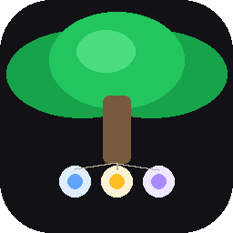

# Canopy — Agent OS

<p align="center">
  
</p>

<p align="center">
  <strong>The operating system layer for your AI coding agents.</strong><br>
  Monitor multiple Claude Code sessions from a floating overlay, respond to permission prompts without switching windows, and send commands to background terminals.
</p>

## What It Does

When you run multiple AI coding agents across different projects, Canopy lets you:

- **See all sessions at once** — Live screenshots in a floating panel, updated every 2 seconds
- **Respond to permission prompts remotely** — Allow/Deny buttons appear when a background agent needs permission, without leaving your current work
- **Send commands to background terminals** — Type in the floating panel, text goes to the correct terminal via VS Code REST Control
- **Smart window filtering** — Only shows projects you're NOT looking at. When you switch to Chrome or another non-project app, all monitored projects become visible
- **Navigate to any project** — Double-click a project card to switch to that specific VS Code window, even across multiple instances

## Quick Start

### Prerequisites

| Requirement | Version | Notes |
|---|---|---|
| **macOS** | 14.0+ (Sonoma) | Required for APIs used |
| **Swift** | 5.9+ | Comes with Xcode 15+ |
| **Xcode CLT** | Latest | `xcode-select --install` |

### Build & Run

```bash
git clone <repo-url>
cd Canopy
chmod +x build-and-run.sh

# Build + install to /Applications (recommended — permissions persist)
./build-and-run.sh --install

# Or just build + run from build dir (permissions reset each build)
./build-and-run.sh
```

The build script will:
1. Auto-detect your Apple Development certificate (or fall back to ad-hoc signing)
2. Build via `swift build`
3. Create a `.app` bundle with proper Info.plist and app icon
4. Sign and launch

### Grant Permissions

On first launch, Canopy will ask for two permissions:

1. **Screen Recording** — System Settings > Privacy & Security > Screen Recording > Toggle Canopy ON
2. **Accessibility** — System Settings > Privacy & Security > Accessibility > Toggle Canopy ON

You may need to relaunch after granting permissions.

### Add Windows

Canopy starts with an empty dashboard. Click **Add Windows** (+ button in toolbar) to pick from discovered code editors, terminals, and AI tools.

> **Note:** Windows on other macOS Spaces or minimized windows may not appear in the picker. Make them fullscreen or move them to the current Space, then hit Refresh.

## How It Works

### User Flow

1. **Launch Canopy** — Empty dashboard appears
2. **Add windows** — Select VS Code, terminals, or other AI tools from the window picker
3. **Work normally** — When you switch to a project, it disappears from the floating panel. Background projects stay visible with live screenshots
4. **Permission prompts** — When a background Claude Code session asks for permission, the floating panel highlights the source project and shows Allow/Deny buttons
5. **Send commands** — Use the input bar at the bottom of the floating panel to send text to the selected background terminal
6. **Navigate** — Double-click any project card in the floating panel to jump to that window

### Permission Prompt Interception

Canopy installs a Claude Code `PreToolUse` hook that:
- **Blocks** when a background project needs permission (you can't see the terminal)
- **Shows Allow/Deny** on the floating panel with the project name
- **Responds via file IPC** — no keystroke injection for permission responses
- **Passes through** when the project is in the foreground
- **Passes through** when Canopy's main window is active (you can see everything)
- **Passes through** when Canopy isn't running (normal Claude Code behavior)
- **Only intercepts in `default` and `plan` permission modes** — `acceptEdits`, `bypassPermissions`, and `dontAsk` modes are never blocked

### Floating Panel

Appears automatically when you switch away from Canopy. Shows:
- Adaptive grid of background windows (horizontal/vertical based on panel shape)
- All windows when you're on a non-project app (Chrome, Finder, etc.)
- Permission prompt banner with project badge
- Command input bar (uses gesture-based controls for reliable NSPanel interaction)
- Minimize to pill / expand to full app

### Frontmost Detection

Event-driven tracking using:
- `NSWorkspace.didActivateApplicationNotification` for app switches
- `AXObserver` with `kAXFocusedWindowChangedNotification` for within-app window switches (e.g., switching between VS Code windows)
- `kAXFocusedWindowAttribute` for getting the actual focused window title
- 2-second polling fallback as safety net

## Project Structure

```
Canopy/
├── Sources/
│   ├── CanopyApp.swift                    # App entry (@main)
│   ├── Models/
│   │   ├── WindowManager.swift            # Central state manager
│   │   ├── MonitoredWindow.swift          # Window data model
│   │   └── AppCatalog.swift               # 50+ known AI/dev app registry
│   ├── Views/
│   │   ├── CompactDashboardView.swift     # Floating panel UI
│   │   ├── DashboardView.swift            # Main window UI
│   │   ├── PanelTextField.swift           # NSTextField for non-activating panels
│   │   ├── TapButton.swift               # Gesture-based button for panels
│   │   ├── WindowThumbnailView.swift      # Window card with screenshot
│   │   ├── WindowPickerView.swift         # Window selection sheet
│   │   ├── SettingsView.swift             # App settings
│   │   └── PermissionSetupView.swift      # First-run permission guide
│   ├── Services/
│   │   ├── RemoteControlService.swift     # Hook install, prompt IPC
│   │   ├── FrontmostTracker.swift         # Event-driven frontmost detection
│   │   ├── WindowDiscoveryService.swift   # CGWindowList discovery
│   │   ├── WindowInteractionService.swift # AXUIElement + CGEvent
│   │   ├── AttentionDetectionService.swift # Title/idle detection
│   │   ├── FloatingPanelManager.swift     # NSPanel lifecycle
│   │   ├── ContentSharingManager.swift    # Screenshot capture
│   │   ├── CommandService.swift           # REST Control port discovery + send
│   │   └── ClaudeMemService.swift         # Context from claude-mem (optional)
│   └── Resources/
│       └── Assets.xcassets/               # App icon assets
├── build-and-run.sh          # Build, sign, install, launch
├── Package.swift              # SPM config (zero external deps)
├── Info.plist                 # App metadata
└── Canopy.entitlements         # App sandbox disabled
```

## Tech Stack

- **Swift 5.9** / SwiftUI / AppKit — zero external dependencies
- **SQLite3** (system library) — for claude-mem integration
- **Accessibility API** (`AXUIElement`) — window raising, frontmost detection
- **VS Code REST Control** — terminal command sending via HTTP (`terminal.sendSequence`)
- **CGWindowListCopyWindowInfo** — window discovery and screenshots

## Development

```bash
# Build only (debug)
swift build

# Build + launch
./build-and-run.sh

# Build + install to /Applications + launch
./build-and-run.sh --install

# Kill running instance before rebuild
pkill -x Canopy; sleep 0.5 && ./build-and-run.sh
```

No tests or linting configured. No external dependencies — pure Swift Package Manager.

## Command Sending

Canopy sends commands to VS Code terminals via the **REST Control extension** (`dpar39.vscode-rest-control`). This uses VS Code's `workbench.action.terminal.sendSequence` to write directly to the terminal PTY — no clipboard, no keystrokes, no focus stealing.

**Multi-window targeting** works via PID-chain discovery:
1. Find the Claude process whose CWD matches the target project
2. Trace to its parent PID (VS Code pty helper)
3. Find the nearest extension host PID
4. Look up which REST Control port that extension host serves
5. Send to that specific port

**Setup:** Install the VS Code extension: `code --install-extension dpar39.vscode-rest-control` and reload VS Code.

## Known Issues

1. **Hook allow-rule matching** — Simple glob matching can't fully replicate Claude Code's permission logic. Some auto-allowed tools may still trigger the hook.
2. **REST Control extension required** — Command sending requires the `dpar39.vscode-rest-control` VS Code extension to be installed and active.
3. **VS Code windows may not appear in window picker** — `CGWindowListCopyWindowInfo` cannot always enumerate windows on other macOS Spaces or minimized windows. Make them fullscreen or move them to the current Space, then hit Refresh.
